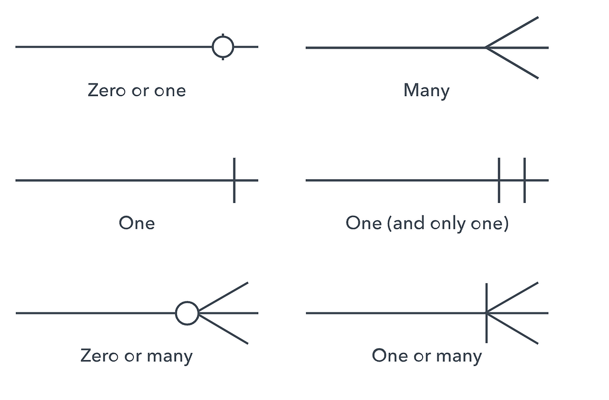

in a DB we do CRUD operations (create, read, update, delete)

Data >>> raw info >>> when we process data we can get info
requirements of data:
1. Integrity
2. Availablity
3. Security
4. Independent of Application
5. Concurrency

databases are costly
so why not use files >>>
1. dependency of program on physical structure of data
2. complex process to retrieve data
3. loss of data on concurrent access
4. inability to give access based on record(Security)
5. Data redundancy

use cases for files >>>
1. on device access(offline access)
2. storing frequent incoming data
3. storing not so important data

Database >>>. shared collection of logically related data and desc of this data.
system used to store, retrieve, organise data

DBMS >>> Database Management system
sftwr system that enables users to define, create, miantain, control, access data

Functions of DBMS >>>
1. Data Management >>> CRUD
2. Integrity >>> maintain accuracy of data
3. Security >>> access to authorized users only
4. Concurrency >>> simultaneous data access for multiple users
5. Transaction >>> any changes in db must be successful or should not happen at Availablity
6. Utilities >>> data import/export, user Management, backup, logging

Types of databases
1. Hierarchical DB >>> old ones
2. Relational DB >>> MySQL, Oracle, MS Acess, PostgreSQL
3. NoSQL DB 
4. Network DB (graph)

Relational Model:
table == Relation 
column == attribute/field
rows == tuples/record
no of rows == cardinality of Relation
no of columns == degree of Relation
no value == NULL

Data Integrity and Constrains
Data integrity refers to the overall accuracy, completeness, and consistency of data stored in a database over its entire lifecycle.
Constraints are the rules enforced at the database level to ensure this integrity. If an action violates a constraint, the database rejects the operation.

Types of integrity:
1. Entity Integrity: Guarantees that each row in a table is uniquely identifiable and not duplicated.
2. Domain Integrity: Ensures that values in a column conform to a defined format, type, and valid range.
3. Referential Integrity: Ensures relationships between tables stay synchronized (no child record points to a non-existent parent record).

Database Keys: DBMS key is an attribute (column or a set og columns) which helps use uniquely identify a row in a relation
why >>>
1. uniquely identify a row
2. enfore data integrity
3. establish relationship between tables/relationship

Types of keys:

1. super key: Any set of attributes that uniquely identifies a tuple (row) in a relation. May contain extra, redundant columns.
Example: In a table with (ID, Email, Name), both {ID} and {Email} and {ID, Name} and {ID, Email} and {Email, Name}are super keys.

2. candidate key: min number of column to become a primary key {ID}, {Email}

3. primary key: the candidate key that we select to become our diffirentiator between the columns
must be always unique, must never be null
A relation can have only one primary key
Good to have criteria >>> numeric, as small as possible

4. Alternate key: (secondary key) any candidate key that was not selected as primary key

5. Foreign key: An attribute in one table that references the primary key (or candidate key) of another table.
Establishes relationships and enforces referential integrity.
Can accept duplicate values and NULL values (unless restricted by NOT NULL).

6. Composite Key: A key that consists of two or more attributes combined together to uniquely identify a record.
Used when no single column is sufficient on its own.
Example: In an Enrollments table, {student_id, course_id} together form the primary key.

7. Compound Key: A specific type of composite key where every attribute that makes up the key is a foreign key in its own right.

8. Surrogate key: An artificial, system-generated identifier with no business meaning (e.g., an AUTO_INCREMENT integer id or a UUID).
Used when natural keys are too long, complex, or prone to change.
 

Entity Relation model (ER Model):
graphical representation of entitie and their relationships which helps in understanding data independent of the actual database implemenetation
entity: real worl objects which have an independent existence and about which we intend to collect data
attribute: a property that decribes an entity

cardinality of relationship:
is the number of instances in one entity which is associated to the number of instance in another
1:1 -> one to one 
1:M -> one to many
M:M -> many to many

crow foot notation

NOTE: to make a M:M relation we need three tables

SQL Queries:
1. DDL (Data Definition Language)
CREATE
ALTER
DROP
TRUNCATE

2. DML (Data Manipulation Language)
INSERT
UPDATE
DELETE
SELECT

3. TCL (Transaction Control Language)
COMMIT
ROLLBACK

4. DCL (Data Control Language)
GRANT
REVOKE

Schema: A schema describes the structure and organization of a database's objects, such as tables, columns, views, and relationships.

Data Types:
(w3schools) >>> MySQL data types

Operators:
w3school

Comments:
-- This is a comment
/*
this is a multi line comment
*/

